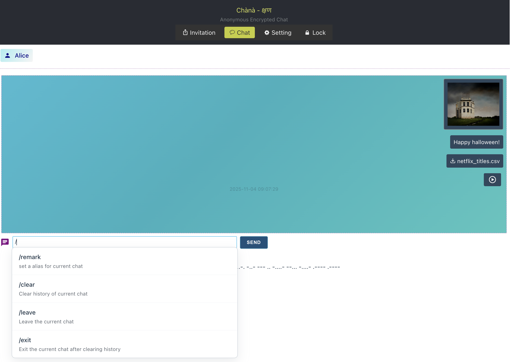
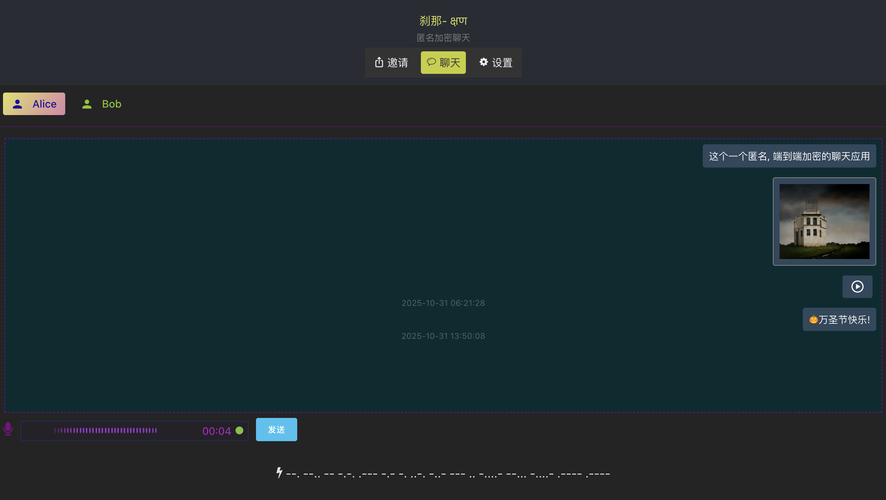
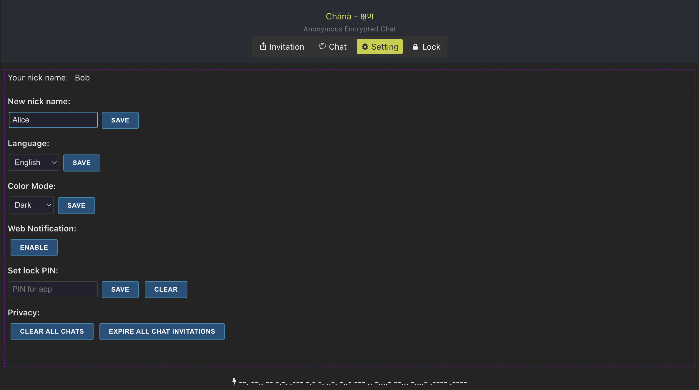

# Chana.chat (Chànà - क्षण) 
Anonymous encrypted chat app, one to one, mobile ready, simple &amp; elegant.

### [中文介绍](./README_CN.md)

### Screenshots
- simple & distraction free ui


- i18n support & dark theme


- settings


### Core Features
- __Anonymous__:
  + NO user registration or personal info required, No email or phone number is required.
  + We use a key pair based ID, which called KID, a 32-byte public key. saved locally.
  + NO persistant messages on server side.
  
- __Security__
  + Using ECDSA (Elliptic Curve Digital Signature Algorithm) to ensures key messages(eg, KID) integrity and authenticity.
  + Using ECDH (Elliptic-curve Diffie–Hellman) to generate a shared AEAD key for private chat.
  + Using XChacha20Poly1305 to encrypt all messages of all chat types.
  + Using pure-rust cryptography implementation to provide fast & safe E2EE feature.
  + Memory Safety: Rust prevents buffer overflows and memory vulnerabilities

> ECDSA & ECDH implementation: Curve25519 (from [dalek-cryptography](https://github.com/dalek-cryptography))
> XChacha20Poly1305 implementaion: [RustCrypto](https://github.com/RustCrypto)
 - __Simple but elegant__
  + Create end-to-end encrypted private chat with one click
  + No client installation, No login.
  + Minimize core functions, distraction free.
  + Lightweight: Minimal resource usage, runs smoothly on any device
  + Mobile ready.
  
## Technical Stack
- Rust: Tokio ecosystem, WebSocket, Cryptography
- Javascript: SolidJS, WebAssembly, MessagePack, IndexedDB


### 🎯 **Effortless User Experience**
- **One-Click Start**: Single command deployment with zero configuration
- **Modern Web UI**: Responsive SolidJS interface works on any device
- **No Setup Required**: Works out-of-the-box with sensible defaults
- **Intuitive Design**: Clean, distraction-free interface focused on conversation

###  Quick Installation

#### Option 1: One-Command Deploy (Recommended)
```bash
# Clone and run in one go
git clone https://github.com/x-ira/chana-chat.git && cd chana-chat
cargo run --release

🎉 Open http://localhost:7788 and start chatting!
```

## Legal & Licensing

**License**: [Apache License v2.0](https://www.apache.org/licenses/LICENSE-2.0) - Use freely, modify, distribute!

### ⚠️ **Responsible Use**
- Use Chana for legal communications only, Not intended for illegal activities.
- Respect local laws and regulations
- Consider security auditing for critical use cases
- This is free software with no warranties

## Security Reporting
Private Issues: Email security issues privately
Responsible Disclosure: Allow time for fixes before public disclosure
Anonymity: Use anonymous communication channels when possible
